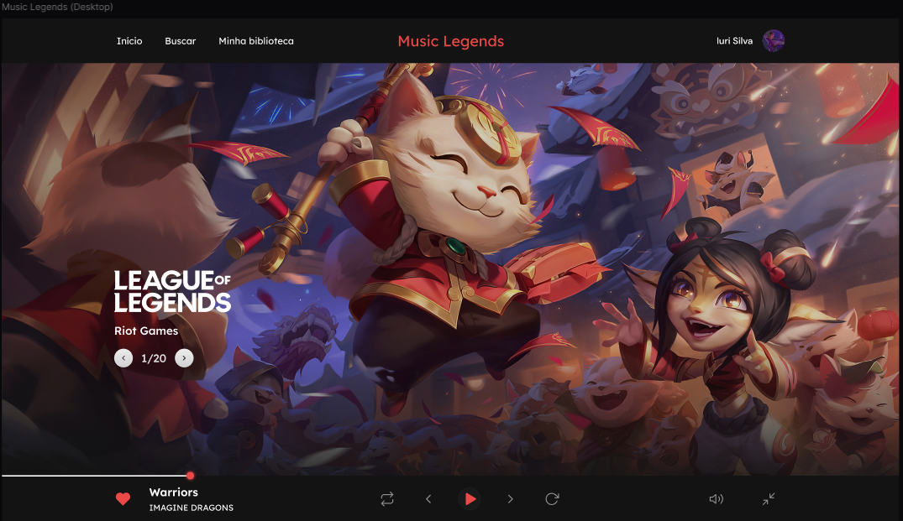

# 🎵 Music Legends (React)


> Um player de música temático inspirado na interface visual do League of Legends, desenvolvido para aprimorar habilidades em Front-end.

## 💻 Sobre o Projeto

Este projeto consiste na criação de uma interface de **Music Player** utilizando a biblioteca **React**. O objetivo principal é consolidar conhecimentos sobre:
* Componentização
* Gerenciamento de Estado (Hooks: useState, useEffect)
* Estilização avançada (CSS/Styled Components/Tailwind)

A identidade visual busca referências no estilo **Hextech** e na UI do cliente do jogo League of Legends.

## 🎨 Layout



## 🚀 Funcionalidades Previstas

- [ ] Play, Pause, Próxima e Anterior
- [ ] Controle de volume
- [ ] Barra de progresso da música

## 🛠 Tecnologias Utilizadas

* **[React](https://reactjs.org/)**
* **[Vite](https://vitejs.dev/)** 
* **CSS Modules / Styled Components / Tailwind** 
* **JavaScript (ES6+)**

---
Ideia desenvolvida por:
* **[Iuri Code](https://www.linkedin.com/in/iuricode/)**
---
Link do wireframe desenvolvido como desafio:
  * **[Figma](https://www.figma.com/design/Yb9IBH56g7T1hdIyZ3BMNO/Desafios---CodeLab?node-id=80254-762&p=f)**
---

## 📂 Como rodar o projeto localmente

Siga os passos abaixo para testar em sua máquina:

1. **Clone o repositório**
   ```bash
   git clone [https://github.com/witin12/music-legends.git](https://github.com/witin12/music-legends.git)